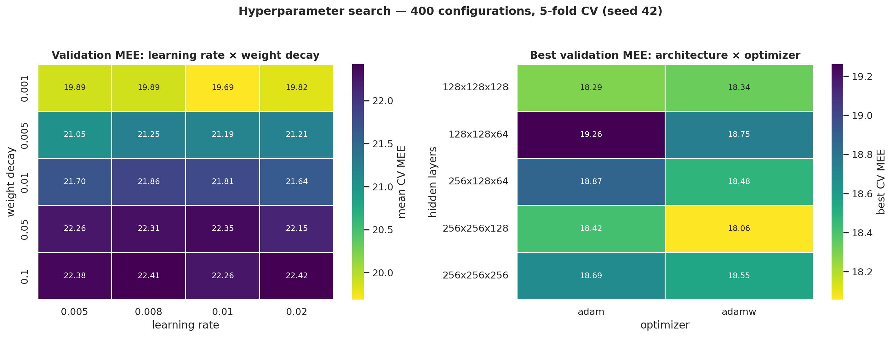
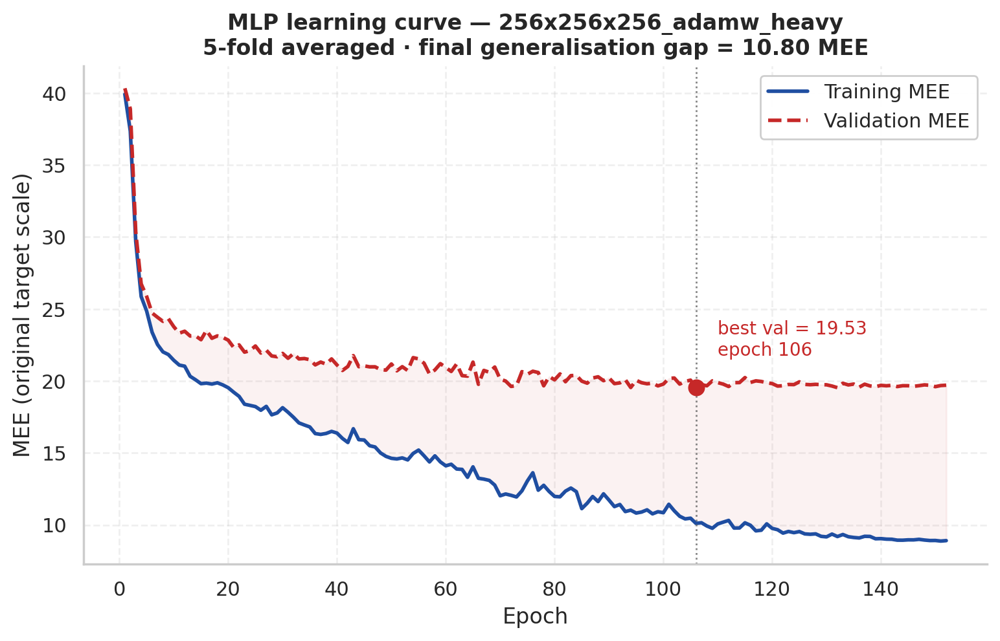
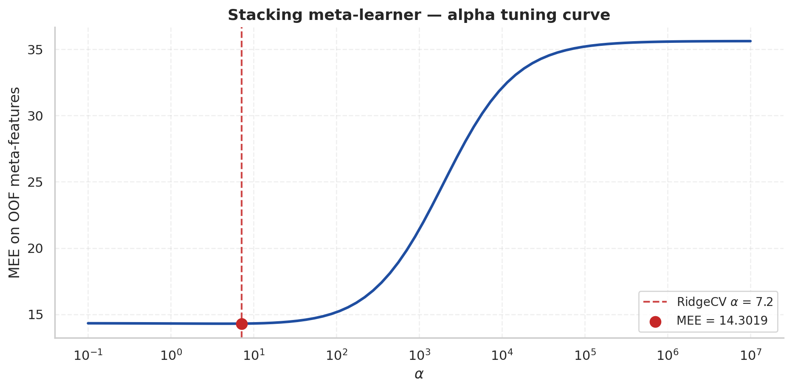
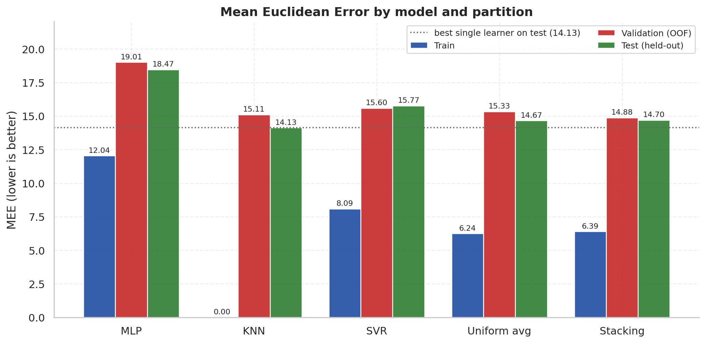
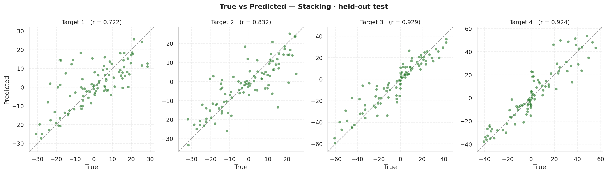
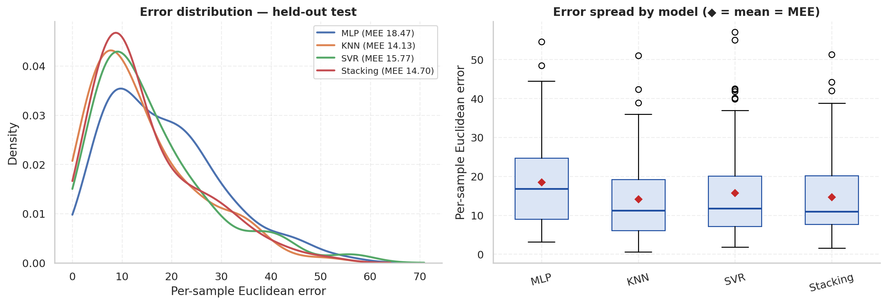

# ML-CUP 2025 — Regression & MONK Classification

**Team EnSIUMble** · Machine Learning 2025/26, University of Pisa · Project type B
Francesco Bernardini (Computer Science — AI) · Alessandro Iacono (Data Science)

A study of six model families run twice: once on the **MONK** classification
benchmarks as a controlled diagnostic, and once on the **ML-CUP 2025**
regression competition as an optimisation problem. The final ML-CUP model is a
stacking ensemble of an MLP, a K-NN regressor and an SVR, combined by a RidgeCV
meta-learner.

| | |
|---|---|
| **Final ML-CUP test MEE** | **14.3289** on a held-out set never touched during model selection |
| **vs OLS baseline** | −45.3% (26.1816 → 14.3289) |
| **MONK-1 / MONK-2** | 100% test accuracy (SVM and MLP) |
| **MONK-3** | 97.22% — a noise ceiling reached by four model families alike |

---

## Table of contents

- [Quick start](#quick-start)
- [Repository layout](#repository-layout)
- [Part 1 — MONK classification](#part-1--monk-classification)
- [Part 2 — ML-CUP regression](#part-2--ml-cup-regression)
  - [Problem and protocol](#problem-and-protocol)
  - [Baselines and the collinearity problem](#baselines-and-the-collinearity-problem)
  - [Hyperparameter search](#hyperparameter-search)
  - [From one model to an ensemble](#from-one-model-to-an-ensemble)
  - [Final architecture](#final-architecture)
- [Results](#results)
- [Reproducibility](#reproducibility)

---

## Quick start

```bash
python -m venv .venv && source .venv/bin/activate
```

```bash
pip install -r requirements.txt
```

```bash
python regression/run_pipeline.py
```

That reproduces the entire final pipeline — 5-fold out-of-fold stacking,
retraining, held-out assessment — in about 15 seconds on a laptop CPU, and
regenerates every figure in [`assets/`](assets/) plus `assets/metrics.json`.

Faster smoke test (1 MLP seed instead of 5, no figures):

```bash
python regression/run_pipeline.py --quick --no-assets
```

Re-running a full hyperparameter grid search (hours, not seconds):

```bash
python regression/gridsearch_NN2.py
```

All scripts anchor their paths to their own location, so they can be launched
from any working directory. No GPU is required.

---

## Repository layout

```
.
├── classification/              MONK benchmarks (diagnostic study)
│   ├── Monks_Summary.ipynb      full analysis, all three MONK problems
│   ├── dataloader.py            one-hot encoding, fit on training set only
│   ├── project_utils.py         shared metrics and plotting helpers
│   └── datasets/                monks-1/2/3 train and test splits
│
├── regression/                  ML-CUP 2025 competition pipeline
│   ├── run_pipeline.py          ← final model, end to end, reproducible
│   ├── make_assets.py           figure generation
│   ├── cup_loader.py            raw loading + the 400/100 split
│   ├── gridsearch_NN.py         first-generation MLP grid search
│   ├── gridsearch_NN2.py        second generation: cosine LR, loss registry
│   ├── ensembling.py            early stacking module
│   ├── Cup_Summary.ipynb        the full narrative analysis
│   └── results/                 grid search logs (CSV, versioned on purpose)
│
├── assets/                      generated figures + metrics.json
├── presentation/                slide deck
└── requirements.txt
```

---

## Part 1 — MONK classification

The MONK problems are synthetic, small, and well understood — which makes them
useful as a *diagnostic* rather than a competition. Each family was tuned
rigorously via 5-fold CV, but no cross-family selection was performed: the
deliverable is an argument about hypothesis space and data quality.

Preprocessing: 6 categorical features → 17 binary via one-hot encoding, with the
encoder fit on the training set only. 432 test samples per problem.

| Model | MONK-1 | MONK-2 | MONK-3 |
|---|---:|---:|---:|
| Logistic Regression | 75.00% | 67.13% | 97.22% |
| Ridge Classifier | 73.61% | 67.13% | 97.22% |
| K-NN | 77.31% | 75.93% | 89.12% |
| SVM | **100.00%** | 85.65% | 97.22% |
| PyTorch MLP | **100.00%** | **100.00%** | 97.22% |

Three findings the table encodes:

**MONK-1 needs non-linearity, but only a little.** Logistic Regression records
zero false positives against 108 false negatives — the signature of a boundary
that cannot bend. A degree-2 polynomial kernel solves it exactly, and so does a
network with 2–4 hidden units. The required feature interactions are simple.

**MONK-2 is where learned features beat designed ones.** Both linear models
collapse to 67.13%, which is not a classifier — it is the class prior (every
prediction falls in one column of the confusion matrix, AUC 0.56). A degree-3
kernel reaches 85.65%. A network with **two hidden units** reaches 100%. When
the required transform is unknown in advance, an adaptive representation beats
a fixed feature map.

**MONK-3 is a data problem, not a model problem.** Four unrelated families stop
at exactly 97.22%. That is a noise ceiling — MONK-3 contains deliberate label
noise. K-NN is the only model that *degrades* (89.12%), and it is also the only
model that memorises individual training points: mislabeled samples inside a
K=11 neighbourhood corrupt the vote, while parametric models fit a global
boundary and average the corruption away. Further architecture search here is
wasted budget.

---

## Part 2 — ML-CUP regression

### Problem and protocol

500 labelled samples, **12 input features**, a **4-dimensional target**. The
competition metric is the Mean Euclidean Error:

$$\text{MEE} = \frac{1}{N}\sum_{p=1}^{N} \left\| \mathbf{y}_p - \hat{\mathbf{y}}_p \right\|_2$$

The protocol was fixed before any modelling and never revisited:

- **80/20 split** — 400 samples carry *all* model selection; 100 are held out
  and touched exactly once, at the end.
- **5-fold CV, seed 42** — identical folds for every model family, so every
  search is scored on the same partitions and results are directly comparable.
- **Scaling inside the fold** — every `StandardScaler` and every PCA is fit on
  fold-training data only. The validation fold is only ever transformed.
- **MSE trains, MEE selects.** Gradient descent minimises MSE on standardised
  targets because it is smoother; every reported number, every early-stopping
  decision and every model-selection ranking uses MEE recomputed in the
  **original target scale**.

### Baselines and the collinearity problem

| Model | Validation MEE |
|---|---:|
| OLS (baseline) | 26.1816 |
| Lasso, α = 0.1 | 25.6353 |
| Ridge, α = 100 | 25.5736 |

Both regularisers improve on plain least squares, and a *heavy* ridge penalty
winning is itself the diagnosis. PCA settles it: **95.6% of the variance in the
12-dimensional input is explained by the first principal component alone**, and
the mean absolute pairwise feature correlation is 0.95. The inputs are close to
collinear.

The caveat is deliberate: high input variance does not imply high correlation
with the target, so the number of components entered the grid as a
hyperparameter over [1, 12] rather than being fixed — mostly to give K-NN a
fighting chance against the curse of dimensionality.

### Hyperparameter search



The MLP search ran as a sequence of medium-sized grids (a few hundred
configurations each) rather than one large one, with each grid's analysis
choosing the axes for the next. Roughly 1,500 configurations in total, all
scored by 5-fold CV on identical folds.

| Stage | Winner | CV MEE |
|---|---|---:|
| First grid | `[32, 16]` · tanh · adam · lr 0.005 · wd 0.001 | 21.952 ± 0.844 |
| Final grid | `[256, 256, 128]` · gelu · adamw · lr 0.02 · wd 0.1 · dropout 0.1 | **18.058 ± 1.168** |

What the search established:

- **batch = 32** consistently minimised MEE — more gradient noise, better generalisation.
- **GELU** was by far the best of five activations tested (tanh, ReLU, GELU, SELU, ELU).
- **Cosine annealing** improved on `ReduceLROnPlateau` across configurations.
- **Adam and AdamW** were the two best optimisers, and they disagree on weight
  decay — Adam's best runs prefer ~0.001, AdamW's prefer 0.05–0.1. That
  disagreement is exploited later as free ensemble diversity.
- Weight initialisation is activation-specific throughout (Xavier for tanh with
  gain 5/3, Kaiming for the ReLU family, LeCun for SELU).

### From one model to an ensemble



The learning curve shows the problem that hyperparameter tuning could not fix:
validation MEE flattens near 19–20 while training MEE keeps falling past 10. A
generalisation gap of that size, stable across every configuration in the grid,
says the remaining error is **variance, not bias**. The response was to stop
optimising the single model and start averaging.

Three stages of increasing heterogeneity, following the Krogh–Vedelsby ambiguity
decomposition — ensemble error equals mean member error minus the ambiguity
(the variance among member predictions), so raising diversity is the only lever
that lowers ensemble error *without* making any member better:

| Stage | What varies | Validation MEE | What it bought |
|---|---|---:|---|
| 1 — multi-seed | 5 seeds, one config | 18.2175 ± 0.755 | Stability (σ 1.17 → 0.76), not a better headline |
| 2 — heterogeneous MLPs | 10 configs across both weight-decay regimes | 17.3900 | First break below 18; gap unchanged |
| 3 — stacking | 3 different model *families* | **14.3715** | Both |

Stage 1 is worth dwelling on: the grid's best seed turned out to be a lucky one.
Averaging across seeds did not improve the headline number, but it cut the
standard deviation by a third — and it exposed that model selection on a single
seed had been partly selecting noise.

### Final architecture

```
                    ┌──────────────────────────────────────┐
    400 train  ──►  │  5-fold CV → out-of-fold predictions │
                    └──────────────────────────────────────┘
                         │            │            │
                   ┌─────▼────┐ ┌─────▼────┐ ┌─────▼────┐
                   │   MLP    │ │   K-NN   │ │   SVR    │
                   │ 256×3    │ │  k = 3   │ │   RBF    │
                   │ gelu     │ │ distance │ │  C = 3   │
                   │ adamw    │ │ PCA = 6  │ │  γ = 3   │
                   │ 5 seeds  │ │          │ │ PCA = 4  │
                   └─────┬────┘ └─────┬────┘ └─────┬────┘
                         └────────────┼────────────┘
                                      ▼
                        12 OOF meta-features (3 models × 4 targets)
                                      ▼
                        ┌─────────────────────────────┐
                        │  RidgeCV meta-learner       │
                        │  α = 10.0 (selected by GCV) │
                        └─────────────────────────────┘
```

Two design decisions are worth stating explicitly, because both are places
where stacking normally leaks:

**The MLP member was chosen by multi-seed restart, not by grid rank.** Because
the grid winner was seed-dependent, all ten finalist configurations were re-run
across five seeds and ranked on the *mean*. The winner changed —
`[256,256,128]` → `[256,256,256]` with AdamW and heavy weight decay.

**Early stopping runs on an inner 90/10 split of the fold-training data**, never
on the outer validation fold. If the fold that produces a meta-feature is also
the fold that picks the stopping epoch, that meta-feature is optimistically
biased and the meta-learner over-weights the model that got the advantage. This
was the single most important correctness detail in the whole pipeline.

The meta-learner is fit **once** on the OOF meta-features and is **not**
refitted before the test evaluation.



Generalised cross-validation selects α = 10.0. The curve is flat below α ≈ 100
and collapses above 10³, so the solution sits comfortably inside a stable region
rather than balanced on a sharp optimum.

---

## Results

Reported results — the submitted model, `Cup_Summary.ipynb`. All values are MEE
in the original target scale; lower is better.

| Model | TR MEE | VL MEE (OOF) | TS MEE |
|---|---:|---:|---:|
| MLP (multi-seed) | 11.8339 | 18.9522 | 17.8870 |
| K-NN | 0.0000 | 15.1070 | **14.1284** |
| SVR | 8.0918 | 15.5959 | 15.7672 |
| Uniform average | — | 15.2976 | 14.4049 |
| **Stacking (RidgeCV)** | **5.9037** | **14.3715** | **14.3289** |







### Reading the table honestly

**K-NN's zero training error is memorisation, not skill** — with `k=3` and
distance weighting, every training point is its own nearest neighbour. That is
precisely why it earns its place in the stack: its error pattern is
uncorrelated with the MLP's, which is what the meta-learner exploits.

**The stack does not beat every member on test.** K-NN alone scores 14.1284
against the stack's 14.3289. The stack wins clearly on out-of-fold validation
(14.3715 vs 15.1070) and it has the smallest validation-to-test drift of any
model in the study — **0.0426**, against 0.17 for SVR, 0.98 for K-NN and 1.07
for the MLP.
What stacking bought here is *stability across partitions*, not a lower headline
number. The 0.20 MEE by which K-NN leads on 100 samples is well inside the noise
of a 100-sample estimate; the drift figure is the more informative statistic.

This is the same trade the multi-seed stage made, and it is worth being straight
about rather than rounding in the ensemble's favour.

---

## Reproducibility

Everything is seeded (`seed_everything` fixes `random`, `numpy`, `torch`,
`PYTHONHASHSEED` and the CUDA backends) and the CV folds are pinned to
`random_state=42` across every experiment.

The sklearn components reproduce **bit-for-bit**:

| | Reported | Fresh run (torch 2.11) |
|---|---:|---:|
| K-NN test | 14.1284 | 14.1284 ✅ |
| SVR test | 15.7672 | 15.7675 ✅ |
| MLP test | 17.8870 | 18.4682 |
| Stacking test | 14.3289 | 14.7006 |

The MLP does not reproduce exactly across PyTorch versions — RNG stream and
kernel changes shift results even with identical seeds — and the stacking figure
inherits that drift. The reported 14.3289 is the measured, submitted result;
the fresh-run column is what `run_pipeline.py` produces on torch 2.11 today.
Pinning `torch` to the original version would close the gap. Both are shown
rather than one silently replacing the other.

## References

Glorot & Bengio (2010), *Understanding the difficulty of training deep
feedforward neural networks* · He et al. (2015), *Delving deep into rectifiers* ·
Klambauer et al. (2017), *Self-normalizing neural networks* · Krogh & Vedelsby
(1995), *Neural network ensembles, cross validation and active learning* ·
Bishop (1995), *Training with noise is equivalent to Tikhonov regularization* ·
Hastie, Tibshirani & Friedman, *The Elements of Statistical Learning*, §7.10.2.

